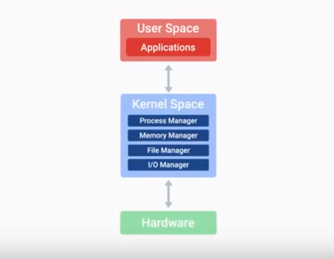

# Fundamental of IT 
###                                                       ----41933049 CFA 张成诚

## Intro

- ### **Introduction**

- ### **History of coputing**

- ### **Digital Logic**

- ### **Computer Architecture Layer**

## Hardware

- ### **The Modern Computer**

- ### **Components**

- ### **Starting It Up**

## Operating System

- ### **What's an operating system?**

#### 1.Components of an Operating System

 Operating system means the whole package that manages our computer's resources and lets us interact with it. It includes two main part:the Kernel Space and the User Space.
  The Kernel is the main core of the operating system, It talks to hardware and manager's system resources. We use User's Space to connect with the Kernel indirectly. Also we uses System programs and user interfaces directly.

 
 We foucus on Windows Mac and Linux among hudreds of operating systems. Windows os's developed by Microsoft and used widely in the business and consumeer space, PC usually refers to Windows computer. Mac os will be pre loaded if you buy an apple cpmputer.The last one is Linux operating system, it's an open source operating system, which means its software is free. Share, modify, and distribute is used heavily. Today, Linux has become a huge community effort with developers all over the world contributing to its success. Because Linux is open source, lots of different organizations package their own version of it, we call these different Linux os's distributions. Some common Linux ditributions are open to Ubuntu, Debian and Red hat. Both carlos and Adroid iOS is the Linux kernel underneath hood.
 
 
 
 The kernel does file storage, file management. just like in an office, we use a system to store files, we don't just put all our files in one cabinet.
 
 
 
 There are different types of file systems. Another important function of the kernel is process management. We manage the order program run on our sysytem and how many resources they take up on the run. Process scheduler is part of the kernel that makes this multitasking possible. Next is memory management, optimize usage and make sure our applications have enough memory to run. The last important function is input and output(IO management), this is how our kernel talks to external devices like disc, keyboards, networks,connections, audiodevices and so on.
 
 
 
 IO management is anything that can give us input or that we can use for outpute of data. The kernel's ability to management is a basic rundown of the main functions of the file management, process management, memory management and I/O management.

User space is everything outside the kernel, people are the thing we interact with directly.

#### 2. Files and File Systems

- ### **Installing an Operating System**

## Networking

- ### **What is networking?**

- ### **Liminations of tne Internet**

- ### **Impact of the Internet**

## Sofeware

- ### **Intro to Software**

- ### **Interacting with Software**

## Troubleshooting

- ### **Troubleshooting Best Practices**

- ### **Customer Service**

#### Anatomy of an Interaction

#### Intro to Soft Skills

- ### **Ducumentation**
